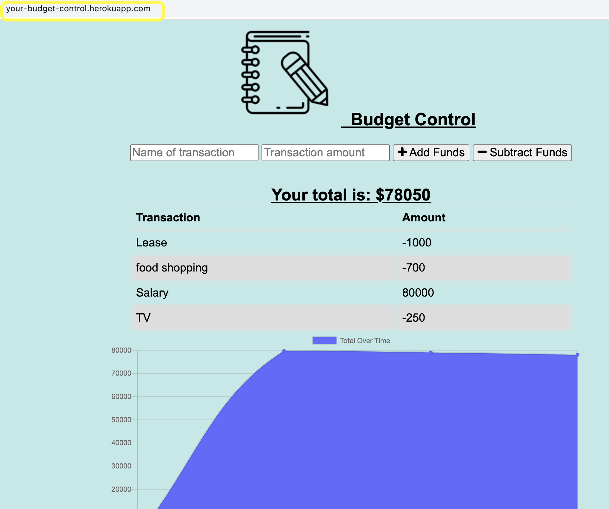
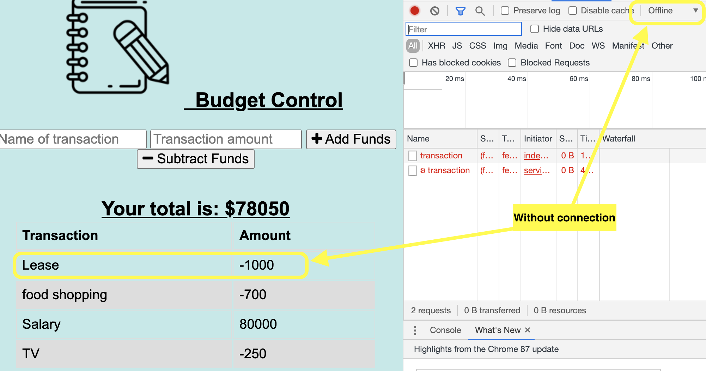
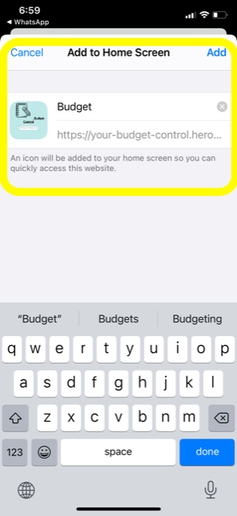
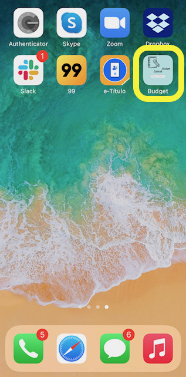
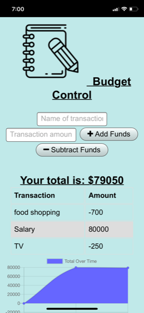
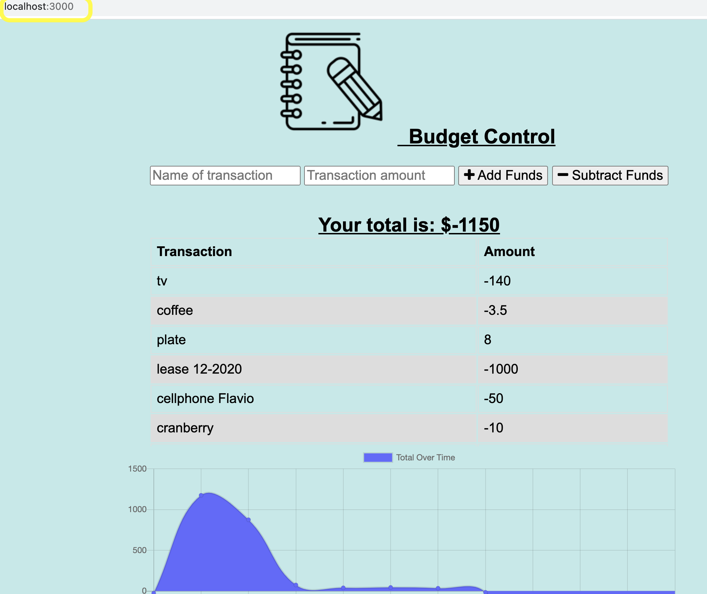

# Budget_Control
### Table of Contents:
  - [Description](#description)
  - [User Story](#userstory)
  - [Installation](#installation)
  - [Run](#run)
  - [Technology](#technology)
  - [Deploy in Heroku](#deploy)
  - [Question](#question) 

### Description 
Add functionality to the existing Budget Tracker application to allow for offline access and functionality.  The user will be able to add expenses and deposits to their budget with or without a connection. When entering transactions offline, they should populate the total when brought back online.

### <a name="userstory"></a>User Story
AS AN avid traveller
I WANT to be able to track my withdrawals and deposits with or without a data/internet connection
SO THAT my account balance is accurate when I am traveling

### Installation
npm install
npm install --save-dev webpack-pwa-manifest

```
Forced the Node.js buildpack to deploy to Heroku
heroku buildpacks:set heroku/nodejs
```

### Run
```
* Run in Terminal: node server.js 
* Browser: http://localhost:3000/
```

### Technology
* PWA - Progressive Web applications
* Indexed Database API 3.0
* Service-Worker
* MongoDB

### Deploy Heroku
https://your-budget-control.herokuapp.com

`Application run in the Heroku`


`Application run offline` 


`PWA - add to Home Screen`


`Mobile budget app icon`


`Budget app on mobile phone running`


### <a name="deploy"></a>Run in Localhost

`Home page`



###  Question 
  For more questions about Team Profile Generator you can go to my Github page at the follow link: 

  - [GitHub Profile](https://github.com/adriana-carmo)
  - [GitHub Budget_Control Repo](https://github.com/adriana-carmo/Budget_Control)

  For additional questions please reach out to my e-mail at : dri.abedala@gmail.com